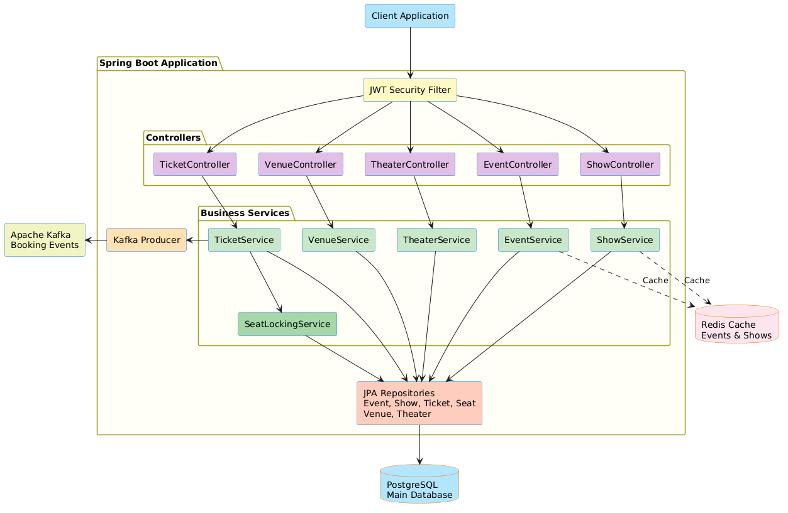
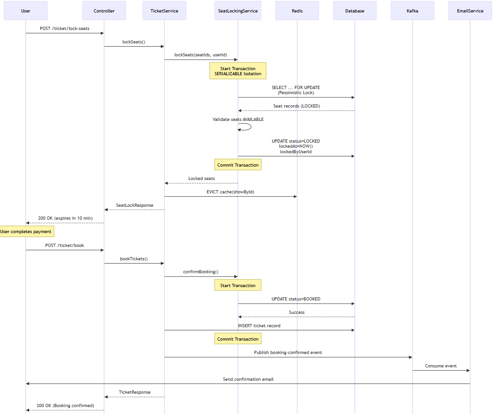
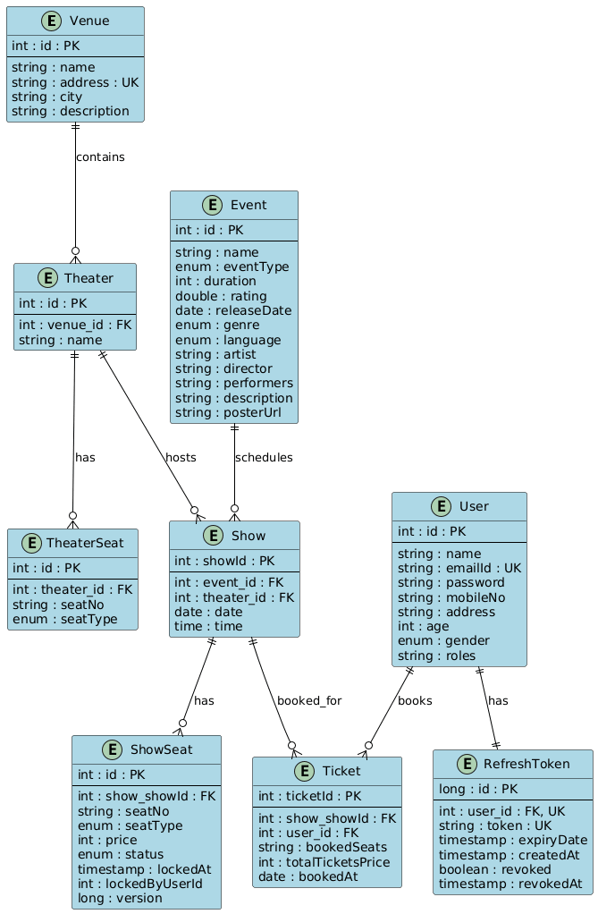

# BookMySeat - Event & Ticket Booking System

A backend API for event and ticket booking built with Spring Boot. Allows users to browse events, view showtimes, select seats, and book tickets with conflict-free seat allocation.


## Features

### User Management
- User registration with BCrypt password hashing
- JWT-based authentication with access & refresh tokens
- User profile management (name, email, phone)
- Role-based access control (USER/ADMIN)
- Admin-only operations for event/show/venue management

### Event & Show Management
- CRUD operations for events
- Multiple shows per event with date/time and venue
- Metadata support: language, genre, duration, rating, director, performers
- Admin-only event and show management

### Venue & Seat Layout
- Venues with auditoriums/screens
- Seating layout with rows, columns, and seat categories (Premium, Classic)
- Unique seat identifiers (e.g., "A1", "B5")
- Seat pricing per show

### Searching and Browsing
- Browse events by city, date, genre, language, event type
- View shows grouped by date and venue
- Real-time seat availability for each show
- Redis caching for event and show listings

### Booking & Seat Allocation

**Booking Flow:**
1. Lock seats (`POST /ticket/lock-seats`) - holds seats for 10 minutes
2. Confirm booking (`POST /ticket/book`) - finalizes booking

**Conflict Prevention:**
- ACID transactions with SERIALIZABLE isolation
- Pessimistic write locks using JPA `@Lock`
- Database-level `SELECT ... FOR UPDATE` queries
- Automatic lock expiry after 10 minutes
- Scheduled job releases expired locks every 2 minutes

**Booking Confirmation Includes:**
- Booking ID
- Booked seats
- Show details (event, venue, date, time)
- Total price
- Timestamp

### Notifications via Message Queue
- Apache Kafka integration
- Publishes `BookingConfirmedEvent` after successful booking
- Publishes `BookingFailedEvent` after failed booking
- Consumer simulates email/SMS notifications
- Booking succeeds even if notification fails

---

## Technology Stack

| Category | Technologies |
|----------|-------------|
| Backend | Spring Boot 3.3.3, Java 17 |
| Security | Spring Security, JWT, BCrypt |
| Database | PostgreSQL 16, Spring Data JPA, Hibernate |
| Caching | Redis 7, Jedis, Spring Cache |
| Messaging | Apache Kafka 7.5.0, Zookeeper |
| API Docs | Swagger/OpenAPI 3.0 |
| Testing | JUnit 5, Mockito, Testcontainers 2.0.2 |
| DevOps | Docker, Docker Compose |
| Build | Maven 3.6+ |

---

## Architecture



---

## Getting Started

### Prerequisites
- Java 17 or higher
- Maven 3.6+
- Docker & Docker Compose

### Setup

1. **Start infrastructure services**
   ```bash
   docker-compose up -d
   ```

2. **Build the application**
   ```bash
   mvn clean install
   ```

3. **Run the application**
   ```bash
   mvn spring-boot:run
   ```

4. **Access the application**
   - API: `http://localhost:8081`
   - Swagger UI: `http://localhost:8081/swagger-ui.html`

---

## API Endpoints

### Authentication

| Method | Endpoint | Description |
|--------|----------|-------------|
| POST | `/api/auth/login` | Login, returns JWT tokens |
| POST | `/api/auth/refresh` | Refresh access token |
| POST | `/api/auth/logout` | Logout |

### Users

| Method | Endpoint | Description |
|--------|----------|-------------|
| POST | `/user/addNew` | Register user |
| GET | `/user/me` | Get profile |
| PUT | `/user/me` | Update profile |

### Events (Admin endpoints require authorization)

| Method | Endpoint | Description |
|--------|----------|-------------|
| POST | `/api/events` | Create event (Admin) |
| GET | `/api/events` | Search events with optional query params: name, city, type, genre, language, date |
| GET | `/api/events/{id}` | Get event by ID |
| PUT | `/api/events/{id}` | Update event (Admin) |
| DELETE | `/api/events/{id}` | Delete event (Admin) |

**Query Parameters for GET /api/events:**
- `name` - Event name (partial match)
- `city` - Filter by city
- `type` - Filter by event type
- `genre` - Filter by genre
- `language` - Filter by language
- `date` - Filter by date (yyyy-MM-dd)

**Event Types:** `MOVIE`, `CONCERT`, `THEATER`, `DANCE_SHOW`, `COMEDY_SHOW`, `OPERA`

### Shows (Admin endpoints require authorization)

| Method | Endpoint | Description |
|--------|----------|-------------|
| POST | `/api/shows/addNew` | Create show with seat prices (Admin) |
| GET | `/api/shows` | Search shows with optional query params: eventId, theaterId, date |
| GET | `/api/shows/{id}` | Get show details |
| GET | `/api/shows/grouped` | Get shows grouped by date & venue |
| GET | `/api/shows/{id}/seats` | Get real-time seat availability |
| PUT | `/api/shows/{id}` | Update show (Admin) |
| DELETE | `/api/shows/{id}` | Delete show (Admin) |

**Query Parameters for GET /api/shows:**
- `eventId` - Filter by event ID
- `theaterId` - Filter by theater ID
- `date` - Filter by date (yyyy-MM-dd)

### Tickets (All require authentication)

| Method | Endpoint | Description |
|--------|----------|-------------|
| POST | `/ticket/lock-seats` | Lock seats for 10 min |
| POST | `/ticket/book` | Confirm booking |
| POST | `/ticket/release-seats` | Release locked seats |
| GET | `/ticket/me` | My booking history |
| GET | `/ticket/{ticketId}` | Ticket details |
| DELETE | `/ticket/{ticketId}` | Cancel ticket |

### Venues (Admin endpoints require authorization)

| Method | Endpoint | Description |
|--------|----------|-------------|
| POST | `/venue/addNew` | Create venue (Admin) |
| GET | `/venue` | Get all venues (optional ?city=X filter) |
| GET | `/venue/{id}` | Get venue by ID |
| PUT | `/venue/{id}` | Update venue (Admin) |
| DELETE | `/venue/{id}` | Delete venue (Admin) |

### Theaters (Admin endpoints require authorization)

| Method | Endpoint | Description |
|--------|----------|-------------|
| POST | `/theater/addNew` | Create theater with seats (Admin) |
| GET | `/theater` | Get all theaters |
| GET | `/theater/{id}` | Get theater by ID |
| PUT | `/theater/{id}` | Update theater (Admin) |
| DELETE | `/theater/{id}` | Delete theater (Admin) |

---

## Conflict-Free Seat Allocation

### How It Works

1. **Pessimistic Database Locking**
   ```java
   @Lock(LockModeType.PESSIMISTIC_WRITE)
   List<ShowSeat> findAndLockByIds(List<Integer> seatIds);
   ```
   Executes `SELECT ... FOR UPDATE` to lock rows at database level.

2. **Transaction Isolation**
   ```java
   @Transactional(isolation = Isolation.SERIALIZABLE)
   ```
   Uses highest isolation level to prevent concurrent modifications.

3. **Seat States**
   - `AVAILABLE` - Can be locked
   - `LOCKED` - Held for 10 minutes
   - `BOOKED` - Permanently reserved

4. **Automatic Cleanup**
   - Scheduled job runs every 2 minutes
   - Releases locks older than 10 minutes

### Booking Flow Sequence



---

## Database Schema



---

## Redis Caching

### Cached Data

| Data | TTL | Eviction |
|------|-----|----------|
| All events | 2 hours | On event create/update/delete |
| Event by ID | 2 hours | On event update/delete |
| Events by type/city/genre/language | 1 hour | On event changes |
| All shows | 30 min | On show create/update/delete |
| Show by ID | 15 min | On show update, seat lock/book |
| Shows by event/theater/date | 30 min | On show changes |

---

## Kafka Integration

### Events Published

**BookingConfirmedEvent:**
- bookingId, userId, userEmail, userName
- showId, eventName, theaterName
- bookedSeats, totalPrice, bookingTime

**BookingFailedEvent:**
- userId, userEmail, showId
- requestedSeats, failureReason, failureTime

### Consumer
- Listens to booking events
- Simulates email/SMS notifications

---

## Testing

### Run Tests
```bash
mvn test
```

**All 13 integration tests passing.** Uses Testcontainers for infrastructure services.

### Manual Testing
- Swagger UI: http://localhost:8081/swagger-ui.html

---

## Docker Services

| Service | Port | Access |
|---------|------|--------|
| Spring Boot | 8081 | http://localhost:8081 |
| PostgreSQL | 5450 | - |
| pgAdmin | 5051 | http://localhost:5051 |
| Redis | 6379 | - |
| RedisInsight | 5540 | http://localhost:5540 |
| Kafka | 9092 | - |
| Kafka UI | 8090 | http://localhost:8090 |
| Zookeeper | 2181 | - |

---

## Security Features

- BCrypt password hashing
- JWT access tokens (30 min expiry)
- JWT refresh tokens (7 day expiry)
- Role-based access control (USER/ADMIN)
- Input validation
- Parameterized SQL queries


